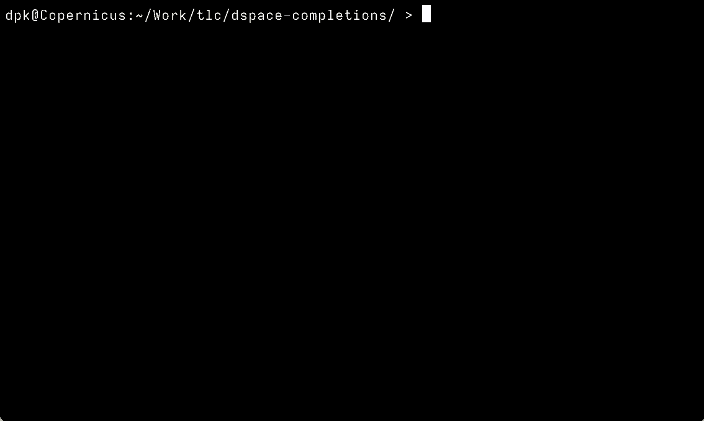

# DSpace shell completions

This repository contains (nearly comprehensive, but not quite) shell completion data for the [`dspace` command-line tool](https://wiki.lyrasis.org/display/DSDOC7x/Command+Line+Operations). They are written with [complgen](https://github.com/adaszko/complgen) so work on bash, zsh, and fish!

## Installation/usage instructions

With a POSIX-compatible make and complgen install, `make` will generate the completion files for bash, zsh, and fish.

You can then `source`/`.` the generated completion files.

The bash completions depend on the standard `bash-completion` package. The zsh and fish completions should just work out-of-the-box.
